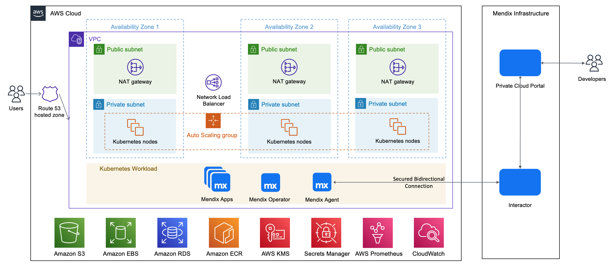
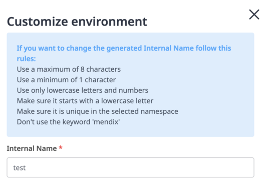

# Terraform Module for Mendix Private Cloud on AWS

This repository represents an Infrastructure as Code (IaC) project which facilitates the creation of repeatable and disposable environments meeting the requirements of Mendix for Private Cloud on AWS.

## Architecture diagram


## Prerequisites

### Mendix Private Cloud
* Create your application on https://privatecloud.mendixcloud.com
* Mendix Runtime Version >= 9.21
* Register a new EKS Cluster
* Add a new Connected Namespace called **mendix**
* Retrieve the cluster id and the cluster secret in the *Installation* tab

### Tools
Install those up-to-date tools :
*  [Terraform](https://learn.hashicorp.com/tutorials/terraform/install-cli)
* An IAM user with programmatic access with at least the following IAM [permissions](deployment-policy.json)
  [AWS CLI](https://docs.aws.amazon.com/cli/latest/userguide/getting-started-install.html)
* Configure AWS CLI with the `ACCESS_KEY_ID` and `SECRET_ACCESS_KEY` and the correct `REGION` corresponding to the IAM user which has the aforementioned IAM permissions (execute `aws configure`).
*  [AWS IAM Authenticator](https://docs.aws.amazon.com/eks/latest/userguide/install-aws-iam-authenticator.html)
*  [kubectl](https://kubernetes.io/docs/tasks/tools/)
*  wget (required for Terraform eks module)
### Terraform 
Provision a S3 bucket with your desired name and a DynamoDB table with the partition key `LockID` (String type), to store the state file and have a locking mechanism respectively.

* Edit the `providers.tf` as the following example:
```
terraform {
  backend "s3" {
    region         = "eu-central-1"
    bucket         = "state-bucket-state"
    key            = "terraform.tfstate"
    dynamodb_table = "dynamodb-table-state"
    encrypt        = true
  }
```
* Edit the `terraform.tfvars` as the following example: : 
```
aws_region                   = ""
domain_name                  = "project-name-example.com"
certificate_expiration_email = "example@example.com"
s3_bucket_name               = "project-name"
cluster_id                   = ""
cluster_secret               = ""
environments_internal_names  = ["app1", "app2", "app3"]
```
The number of applications deployed is handled by the `environments_internal_names` variable, those internal names are used during the environment creation : 

## Provisionning 

To provision a new Mendix for Private Cloud environment, aka Mx4PC, execute the following commands:

```
terraform init
terraform apply
```
Once everything has been successfully provisioned, run the following command to retrieve the access credentials for your new cluster and automatically configure kubectl:

```
aws eks --region $(terraform output -raw region) update-kubeconfig --name $(terraform output -raw cluster_name)
```

Retrieve the aws_route53_zone_name_servers generated using the AWS Console in Route53 -> Hosted Zone, or at the end of the run using this command :

```
terraform output aws_route53_zone_name_server
```
Depending on your provider, update your external Domain Name Registrar or Route53 registered domain with those values following this documentation [Route53 Documentation](https://docs.aws.amazon.com/Route53/latest/DeveloperGuide/dns-configuring.html).

Enable the External Secrets Store in the *Customization* tab of the Mendix for Private Cloud Portal Cluster Manager.

## Security
### Cluster endpoint
Kubernetes API requests within your cluster's VPC (such as node to control plane communication) use the private VPC endpoint.
Your cluster API server is accessible from the internet. You can, optionally, limit the CIDR blocks that can access the public endpoint as mentionned in the [Amazon EKS Documentation](https://docs.aws.amazon.com/eks/latest/userguide/cluster-endpoint.html) by setting up the ``allowed_ips`` variable.

### Encryption
All the EBS volumes, the RDS PostgreSQL database and the S3 storage bucket are encrypted at rest. The end-to-end TLS encryption is handled at the Ingress NGINX Controller level, a certificate is generated for each app by cert-manager, configured with a Let’s Encrypt certificate issuer.

## Automatic scaling
All the Amazon EKS nodes are placed in an Auto Scaling group, but it doesn’t install
the [Kubernetes Cluster Autoscaler](https://github.com/kubernetes/autoscaler/tree/master/cluster-autoscaler) by default. The Cluster Autoscaler provides automatic
scale-up and scale-down by allowing Kubernetes to modify the Amazon EC2 Auto Scaling
groups.

## Logging monitoring
A basic logging and monitoring stack contaning Prometheus, Grafana, Loki and Promtail is provisionned by default, reacheable using this URL : https<span>://monitoring.{domain_name}

To retrieve the Grafana admin credentials : 
```
terraform output -json grafana_admin_password
```
## Troubleshooting
* For Mac M1 users, in order to fix this error: 
```
│ Provider Terraform Registry 38 v2.2.0 does not have a
│ package available for your current platform, darwin_arm64
```
Install [m1-terraform-provider-helper](https://github.com/kreuzwerker/m1-terraform-provider-helper):
```
brew install kreuzwerker/taps/m1-terraform-provider-helper
m1-terraform-provider-helper activate
m1-terraform-provider-helper install hashicorp/template -v v2.2.0
```
* Windows users:
```
terraform providers lock -platform=linux_amd64 -platform=darwin_amd64
```
* Mendix Agent/Operator not connected or misconfigured.

Retrieve the logs of the installer job :
```
kubectl logs job.batch/mxpc-cli-installer -n mendix
```

Expected output : 
```
-- Done-- Applying Kubernetes Secrets... Done!
-- Applying Service Accounts... Done!
-- Applying Storage Plans... Done!
-- Applying Operator Patches... Done!
-- Successfully applied all the configuration!
operatorconfiguration.privatecloud.mendix.com/mendix-operator-configuration patched
operatorconfiguration.privatecloud.mendix.com/mendix-operator-configuration patched
operatorconfiguration.privatecloud.mendix.com/mendix-operator-configuration patched
```
* Reinstall the installer :
```
terraform destroy -target=helm_release.mendix_installer
terraform plan; terraform apply --auto-approve
```
## Cleanup

To completely clean up your environment, destroy using this reverse order.
```
terraform destroy -target="module.eks_blueprints_kubernetes_addons.module.ingress_nginx[0].module.helm_addon.helm_release.addon[0]" -auto-approve
terraform destroy -target="module.eks_blueprints_kubernetes_addons.module.ingress_nginx[0].kubernetes_namespace_v1.this[0]" -auto-approve
terraform destroy -target="module.eks_blueprints_kubernetes_addons.module.prometheus[0].module.helm_addon.helm_release.addon[0]" -auto-approve
terraform destroy -target="module.eks_blueprints_kubernetes_addons.module.prometheus[0].kubernetes_namespace_v1.prometheus[0]" -auto-approve
terraform destroy -target="module.eks_blueprints_kubernetes_addons" -auto-approve
terraform destroy -auto-approve

```

## License 

[](https://opensource.org/licenses/Apache-2.0)