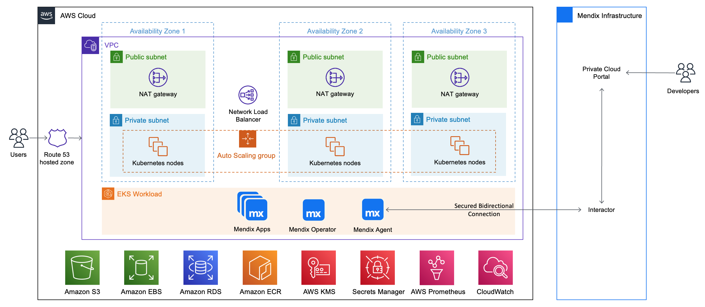

# Terraform Module for Mendix on Amazon EKS

This repository represents an Infrastructure as Code (IaC) project which facilitates the creation of repeatable and disposable environments meeting the requirements of Mendix for Private Cloud on AWS. By using the Mendix on Amazon EKS solution, you can deploy apps in the AWS cloud in a simplified, automated way.

## 1 Architecture Diagram



This Partner Solution sets up the following:

* A highly available architecture that spans three Availability Zones.
* A VPC configured with public and private subnets according to AWS best practices, to provide you with your own virtual network on AWS.
* In the public subnets, managed network address translation (NAT) gateways to allow outbound internet access for resources in the private subnets.
* In the private subnets, Kubernetes nodes in an Auto Scaling group.
* A Network Load Balancer directing traffic to the Kubernetes nodes.

## 2 Prerequisites

Before you can provision your Mendix environments on Amazon EKS, you must first install and configure the required tools, as well as configure the necessary settings in Terraform and in Mendix Private Cloud.

### 2.1 Tools

To configure the required tools, perform the following steps:

1. Install the latest version of [Terraform](https://learn.hashicorp.com/tutorials/terraform/install-cli).
2. Configure an IAM user with programmatic access and at least [the following IAM permissions](deployment-policy.json).
3. Install the latest version of [AWS CLI](https://docs.aws.amazon.com/cli/latest/userguide/getting-started-install.html).
4. Execute `aws configure` to configure AWS CLI with the `ACCESS_KEY_ID`, `SECRET_ACCESS_KEY`, and `REGION` corresponding to your IAM user.
5. Install the latest version of [AWS IAM Authenticator](https://docs.aws.amazon.com/eks/latest/userguide/install-aws-iam-authenticator.html).
6. Install the latest version of [kubectl](https://kubernetes.io/docs/tasks/tools/).
7. Download [GNU Wget](https://www.gnu.org/software/wget/) (required for the Terraform EKS module).

### 2.2 Mendix Private Cloud

To configure your Mendix private cloud environment, perform the following steps:

1. Ensure that your [Mendix Runtime](https://docs.mendix.com/refguide/runtime/) version is 9.21 or newer.
2. Create your Mendix app. For more information, see [Deploying a Mendix App to a Private Cloud Cluster](https://docs.mendix.com/developerportal/deploy/private-cloud-deploy/).
3. Register a [new EKS cluster](https://docs.mendix.com/developerportal/deploy/private-cloud-cluster/#create-cluster).
4. [Add a new connected namespace](https://docs.mendix.com/developerportal/deploy/private-cloud-cluster/#add-namespace) called *mendix*.
5. Retrieve the cluster ID and the cluster secret in the [Installation tab](https://docs.mendix.com/developerportal/deploy/private-cloud-cluster/#download-configuration-tool) for your namespace.

### 2.3 Terraform 

To configure Terraform, perform the following steps:

1. Provision an S3 bucket with your desired name and a DynamoDB table with the partition key `LockID` (String type), to store the state file and have a locking mechanism respectively.
2. Edit the `providers.tf` as in the following example:

    ```
    terraform {
      backend "s3" {
        region         = "eu-central-1"
        bucket         = "state-bucket-state"
        key            = "terraform.tfstate"
        dynamodb_table = "dynamodb-table-state"
        encrypt        = true
      }
    ```

3. Edit the `terraform.tfvars` as in the following example:

    ```
    aws_region                   = ""
    domain_name                  = "project-name-example.com"
    certificate_expiration_email = "example@example.com"
    s3_bucket_name               = "project-name"
    cluster_id                   = ""
    cluster_secret               = ""
    environments_internal_names  = ["app1", "app2", "app3"]
    ```

The number of applications deployed is handled by the `environments_internal_names` variable. Internal names are used during the environment creation:


> When you create your Mendix app, the internal name must be the same as the one specified in the `environments_internal_names` variable.

## 3 Provisioning a New Environment

To provision a new environment, perform the following steps:

1. Execute the following commands:

    ```
    terraform init
    terraform apply
    ```

2. Once everything has been successfully provisioned, run the following command to retrieve the access credentials for your new cluster and automatically configure kubectl:

    ```
    aws eks --region $(terraform output -raw region) update-kubeconfig --name $(terraform output -raw cluster_name)
    ```

3. To retrieve the *aws_route53_zone_name_servers* generated using the AWS Console, click **Route53** > **Hosted Zone**, or run the following command:

    ```
    terraform output aws_route53_zone_name_server
    ```

4. Depending on your provider, update your **External Domain Name Registrar** or **Route53 registered domain** with the *aws_route53_zone_name_servers* values. For more information, see [Route53 Documentation](https://docs.aws.amazon.com/Route53/latest/DeveloperGuide/dns-configuring.html).
5. Enable the External Secrets Store in the **Customization** tab of the **Cluster Manager** in Developer Portal.


## 4 Security

### 4.1 Cluster Endpoint

Kubernetes API requests within your cluster's VPC (such as node to control plane communication) use the private VPC endpoint.

Your cluster API server is accessible from the internet. If required, you can limit the CIDR blocks that can access the public endpoint by configuring the ``allowed_ips`` variable. For more information, see [Amazon EKS cluster endpoint access control](https://docs.aws.amazon.com/eks/latest/userguide/cluster-endpoint.html) in the Amazon EKS Documentation.

### 4.2 Encryption

All the EBS volumes, the RDS PostgreSQL database, and the S3 storage bucket are encrypted at rest. The end-to-end TLS encryption is handled at the Ingress NGINX Controller level. A certificate is generated for each app by *cert-manager*, configured with a *Let’s Encrypt* certificate issuer.

## 5 Automatic Scaling

All the Amazon EKS nodes are placed in an Auto Scaling group, but the [Kubernetes Cluster Autoscaler](https://github.com/kubernetes/autoscaler/tree/master/cluster-autoscaler) is not installed by default. The Cluster Autoscaler provides automatic
scale-up and scale-down by allowing Kubernetes to modify the Amazon EC2 Auto Scaling groups.

## 6 Logging and Monitoring

A basic logging and monitoring stack contaning Prometheus, Grafana, Loki and Promtail is available at the following URL: `https://monitoring.{domain_name}`

To retrieve the Grafana admin credentials, run the following command: 

```
terraform output -json grafana_admin_password
```

## 7 Troubleshooting

If you encounter any issues while provisioning your Mendix environments on Amazon EKS, use the following troubleshooting tips to help you solve them.

### 7.1 Terraform Registry Does Not Have a Package Available (Mac)

When initializing Terraform, Apple M1 users may encounter the following error: 

```
│ Provider Terraform Registry 38 v2.2.0 does not have a
│ package available for your current platform, darwin_arm64
```
#### 7.1.1 Solution

Install [m1-terraform-provider-helper](https://github.com/kreuzwerker/m1-terraform-provider-helper):

```
brew install kreuzwerker/taps/m1-terraform-provider-helper
m1-terraform-provider-helper activate
m1-terraform-provider-helper install hashicorp/template -v v2.2.0
```

### 7.2 Mendix Agent or Operator Not Connected or Misconfigured

You may receive an error stating that the Mendix Agent or the Mendix Operator are not configured correctly, or that they are not connected.

#### 7.2.1 Solution

To solve this issue, perform the following steps:

1. Retrieve the logs of the installer job by running the following command:

    ```
    kubectl logs job.batch/mxpc-cli-installer -n mendix
    ```

    You should receive the following output: 

    ```
    -- Done-- Applying Kubernetes Secrets... Done!
    -- Applying Service Accounts... Done!
    -- Applying Storage Plans... Done!
    -- Applying Operator Patches... Done!
    -- Successfully applied all the configuration!
    operatorconfiguration.privatecloud.mendix.com/mendix-operator-configuration patched
    operatorconfiguration.privatecloud.mendix.com/mendix-operator-configuration patched
    operatorconfiguration.privatecloud.mendix.com/mendix-operator-configuration patched
    ```
 
2. Reinstall the installer by running the following command:

    ```
    terraform destroy -target=helm_release.mendix_installer
    terraform plan; terraform apply --auto-approve
    ```

## 8 Cleanup

To completely clean up your environment, run the following commands:

```
terraform destroy -target="module.eks_blueprints_kubernetes_addons.module.ingress_nginx[0].module.helm_addon.helm_release.addon[0]" -auto-approve
terraform destroy -target="module.eks_blueprints_kubernetes_addons.module.ingress_nginx[0].kubernetes_namespace_v1.this[0]" -auto-approve
terraform destroy -target="module.eks_blueprints_kubernetes_addons.module.prometheus[0].module.helm_addon.helm_release.addon[0]" -auto-approve
terraform destroy -target="module.eks_blueprints_kubernetes_addons.module.prometheus[0].kubernetes_namespace_v1.prometheus[0]" -auto-approve
terraform destroy -target="module.eks_blueprints_kubernetes_addons" -auto-approve
terraform destroy -auto-approve
```

## 9 License 

[](https://opensource.org/licenses/Apache-2.0)
